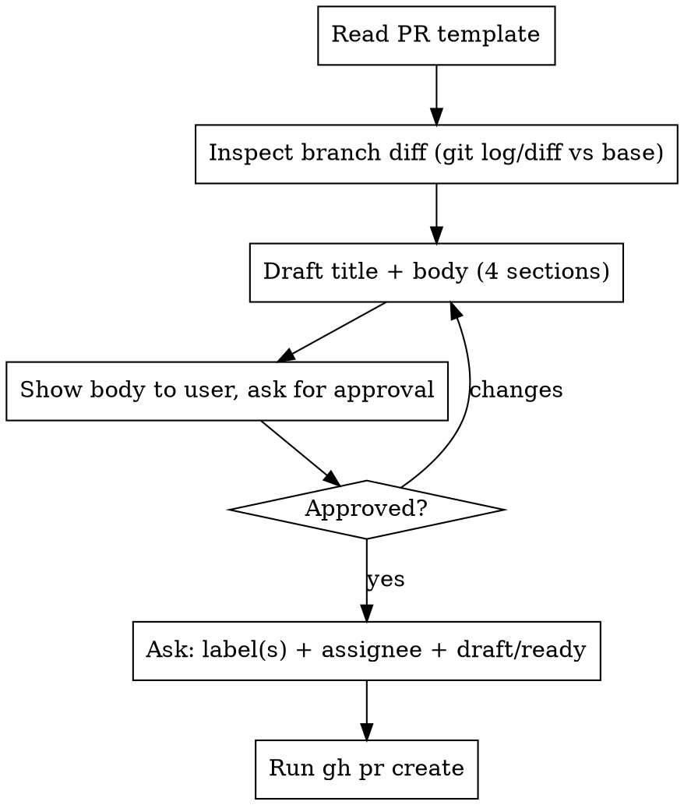

# Creating a Pull Request

## Overview

This repo has a PR template at `.github/PULL_REQUEST_TEMPLATE.md`. A good PR body
fills that template and is shown to the user for approval **before** the PR is
opened. The PR body is the reviewer's main context — write it so someone with no
prior knowledge of the change understands what changed and why.

## The Body Is a Contract

Produce the PR body with exactly these four sections, in this order, matching the
repo template (`개요 / 기존 상황 / 변경한 부분 / 검증`):

1. **## 개요** — 이 PR이 무엇을 하고 왜 하는지 한두 문단. 첫 문장은 한 줄로
   "무엇을 했다"를 명확히. 도메인 약어/내부 용어는 처음 등장할 때 짧게 풀어 쓰고,
   해결하는 문제나 동기를 한 문장 덧붙인다.
2. **## 기존 상황** — 이 PR 이전의 동작/제약. "before" 상태를 분명히.
3. **## 변경한 부분** — 파일/주제 단위로 무엇이 바뀌었는지 (커밋 단위 나열 아님).
   신규/수정/삭제 구분.
4. **## 검증** — 각 검증을 "**어떤 기능**이 **어떤 상황**에서 **어떤 결과**를
   내는지" 한 줄로 서술한다. 예: "매도 거래 시 거래세가 매수보다 큰 비용으로
   가산되는지 확인". 파일명만 나열하거나 `pytest N passed`만 적지 말 것 —
   회귀 결과는 이 동작 서술 뒤에 한 줄로 덧붙인다.

Read `.github/PULL_REQUEST_TEMPLATE.md` first and mirror its section headings
verbatim. If the template changes, the template wins over this list.

## Required Workflow

**Always show the full title + body to the user and wait for approval before
running `gh pr create`.** Do not open the PR from a body the user has not seen.

**Before running `gh pr create`, ask the user for these three, every time:**

1. **Label(s)** — run `gh label list` and offer the existing labels (don't invent
   new ones). User may pick none.
2. **Assignee** — offer `@me` (the current `gh` user) as the default; user may name
   someone else or skip.
3. **Draft or ready** — `--draft` vs ready PR.

Pass the answers through: `gh pr create ... --label <l1,l2> --assignee <user>`.
Omit a flag if the user picks none for it.

## Conventions for This Repo

- **Commit/PR title:** Conventional-commit prefix, no scope parens. `feat: ...`,
  `fix: ...`, `refactor: ...`, `test: ...`. (Not `feat(env): ...`.)
- **Base branch:** If the work stacks on another open PR's branch, set `--base`
  to that branch (stacked PR) and note it in 개요. Otherwise base is `main`.
- **Draft vs ready:** Ask the user whether to create as `--draft` or ready.
- **Label / assignee:** Always ask (see workflow). Use only existing labels from
  `gh label list`. Default assignee offer is `@me`.
- **Body via file:** Write the body to a temp file and pass `--body-file` (avoids
  shell-escaping issues with Korean text and backticks).

## Quick Reference

| Step | Action |
|------|--------|
| 1 | Read `.github/PULL_REQUEST_TEMPLATE.md` |
| 2 | `git log <base>..HEAD` + `git diff --stat <base>..HEAD` |
| 3 | Draft title (conventional, no parens) + body (4 template sections) |
| 4 | Show body to user → get approval |
| 5 | Ask: label(s) (`gh label list`) + assignee (`@me` default) + draft/ready |
| 6 | `gh pr create [--draft] --base <base> --title ... --body-file <tmp> [--label ...] [--assignee ...]` |

## Common Mistakes

- **Inventing your own section structure** instead of the template's 4 sections.
  Read the template and mirror it.
- **Opening the PR without showing the body first.** The approval gate is required.
- **Listing test filenames** instead of describing what each test verifies.
- **Commit-by-commit changelog** in 변경한 부분 — summarize by file/topic instead.
- **Scope parens in the title** (`feat(env): ...`). Use `feat: ...`.
